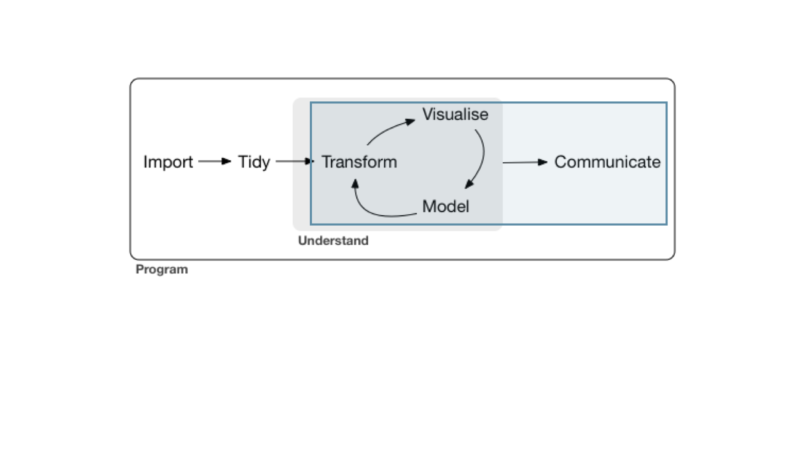

```{r child = "../setup.Rmd"}
```

```{r packages, echo=FALSE, message=FALSE, warning=FALSE}
library(tidyverse)
```

class: middle

# Welcome!

---

## These slides are made with R

.pull-left[
```{r echo=FALSE,out.width="80%",fig.align="center"}

```
]
.pull-right[
__Mardakhlan__
- Backbone of these slides was made by Mine Çetinkaya-Rundel
- She is an amazing data Scientist & Professional Educator, RStudio

.midi[
`r emo::ji("bird")`  [@minebocek](https://twitter.com/minebocek)  
]
]

---

## Logistics

- Everything in one place: [https://bit.ly/3i3zzX0](https://bit.ly/3i3zzX0)
- RStudio Cloud: [https://rstudio.cloud/spaces/86874/project/1593858](https://rstudio.cloud/spaces/86874/project/1593858)
- Asking for help: Type in chat and feel free to interrupt 

---

## What we will cover today? 

- R set up & hands on example of data wrangling problem

---

class: middle   

# Software

---

```{r echo=FALSE, out.width="50%"}
knitr::include_graphics("img/r.png")
```

---

```{r echo=FALSE, out.width="80%"}
knitr::include_graphics("img/rstudio.png")
```

---

class: middle

# Data science life cycle

---

```{r echo=FALSE}
knitr::include_graphics("img/data-science-cycle-01.jpeg")
```

---

```{r echo=FALSE}
knitr::include_graphics("img/data-science-cycle-02.jpeg")
```

---

```{r echo=FALSE}
knitr::include_graphics("img/data-science-cycle-03.jpeg")
```

---

```{r echo=FALSE}
knitr::include_graphics("img/data-science-cycle-04.jpeg")
```

---

```{r echo=FALSE}
knitr::include_graphics("img/data-science-cycle-05.jpeg")
```

---

```{r echo=FALSE}
knitr::include_graphics("img/data-science-cycle-06.jpeg")
```


```{r echo=FALSE}
knitr::include_graphics("img/data-science-cycle-09.jpeg")
```

---

```{r echo=FALSE}

```

---
## RStudio

```{r echo=FALSE, out.width="80%", fig.align="center"}
knitr::include_graphics("img/rstudio-anatomy.png")
```

---
class: middle

# Let's dive in!

---

---

.your-turn[
Take a few minutes to log in and launch Rstudio on your computer.
]

```{r echo=FALSE}
countdown(minutes = 10)
```
---

## R Markdown

```{r echo=FALSE, out.width="100%", fig.align="center"}
knitr::include_graphics("img/rmarkdown-anatomy.png")
```

---

## How will we use R Markdown?

- You'll always have a template R Markdown document to start with

---

class: middle

.huge-blue[tidyverse]

```{r echo=FALSE,out.width="15%", fig.align="right"}
knitr::include_graphics("img/tidyverse.png")
```

---

## tidyverse

.pull-left[
The tidyverse is an opinionated collection of R packages designed for data science. 

All packages share an underlying design philosophy, grammar, and data structures.
]
.pull-right[
```{r echo=FALSE}
knitr::include_graphics("img/tidyverse-packages.png")
```
]


---

## R

- R can be used as a calculator.
```{r}
8738787213 / 1653
```

- The most commonly used data type in R is data frames, where each row represents an observation, and each column a variable.

```{r echo=FALSE}
head(presidential) %>% as.data.frame()
```

---

## R

- We use the `$` operator to access a variable within a data frame.

```{r}
presidential$name
```


- Functions are (often) verbs, followed by what they will be applied to in parentheses.

```{r eval=FALSE}
do_this(to_this)
do_that(to_this, to_that, with_those)
```
---

## R

- In R, the fundamental unit of shareable code is the package.
--

- Using R packages:
  - Install them from CRAN with `install.packages("x")`
  - Use them in R with `library(x)`
  - Get help on them with package `?x` and `help(package = "x")`

---

```{r echo=FALSE, out.width="80%"}
knitr::include_graphics("img/pipe.jpeg")
```

---

.your-turn[
Let's explore an real life example
]

```{r echo=FALSE}
countdown(minutes = 20)
```
