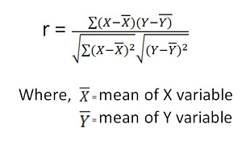

```{r child = "../setup.Rmd"}
```

```{r packages, echo=FALSE, message=FALSE, warning=FALSE}
library(emo)
library(tidyverse)
library(ggpubr)
library(palmerpenguins)
```
---
class: middle

# How would you define a correlation test?

---
class: middle

# Correlation tests association`r emo::ji('two_hearts')`

---
class: middle

# Correlation evaluates the __linear__ association between two or more variables.
---
class: middle

# How many methods to perform correlation analysis you know?
---

## Different methods to perform correlation analysis depending on data type 

```{r echo=FALSE, out.width="50%"}
  
```
---
## Most widely used method is Pearson's 

```{r echo=FALSE, out.width="60%",fig.align='center'}

```
---

## Example: comparing the correalation between two replicates of a gene expresion experiment  

These are two continues values and **might** followed a normal distribution.

We need to check that the later is true.  

---
class: middle

# Pearson correlation

Pearson correlation (r) measures the linear dependence between two variables.

r comes linear regression curve uppon plotting of y = f(x).

To calculate r:
```{r echo=FALSE, out.width="40%"}

```
And to calculate the significance associated to it. 
```{r echo=FALSE, out.width="15%"}

```


---
class: middle

# Other correlation methods 

Ranking: Spearman & Kendall

```{r echo=FALSE, out.width="20%"}
#knitr::include_graphics("img/grammar-of-graphics.png")
```
---

class: middle

# Showing association

To show association, variables are plotted as scatterplot 

```{r echo=FALSE, out.width="40%"}

```
---

# R functions for correlation

- Base R
    - cor(iris$Sepal.Length, iris$Petal.Length, method = c("pearson"),na.rm = TRUE)
    - cor(iris$Sepal.Length, iris$Petal.Length, method = c("spearman"))
  + cor.test(iris$Sepal.Length, iris$Petal.Length,method=c("pearson"))
- library(corrplot)
    corrplot(cor(iris[,1:4]))
- library(Hmisc)
   rcorr(as.matrix(iris[,1:4]))
    
---

class: middle

# Let's dive in some proteomics data and explore correlation across replicates!
---
