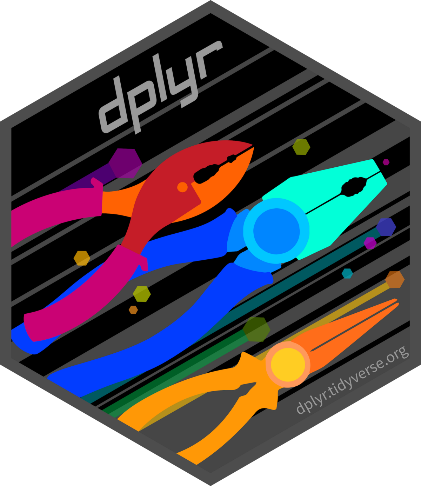
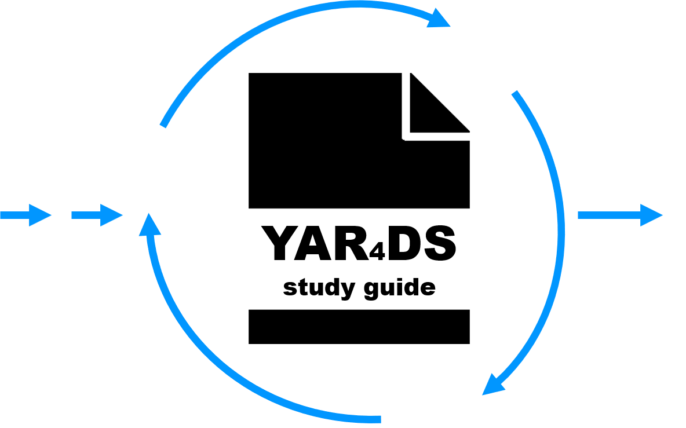
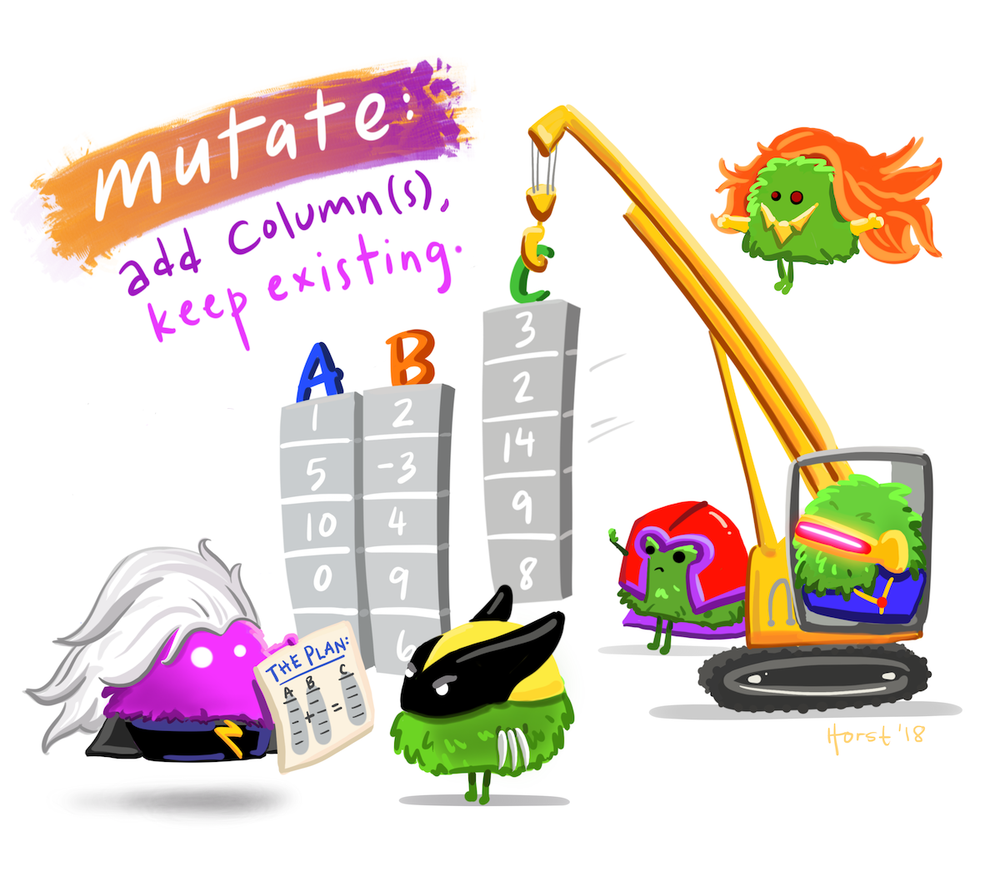
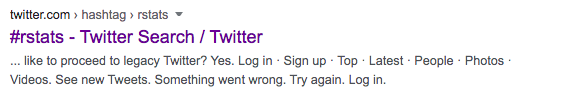

```{r child = "../setup.Rmd"}
```

```{r packages, echo=FALSE, message=FALSE, warning=FALSE}
library(emo)
library(tidyverse)
library(palmerpenguins)
```
---

## Tidyverse overview

```{r echo=FALSE, out.width="80%",fig.align='center'}
  knitr::include_graphics("img/tidyverse.png")
```
---
## Tydiverse learning trip

```{r echo=FALSE, out.width="80%",fig.align='center'}
  knitr::include_graphics("img/tour-overview-lrg.png")
```
Credit to Silvia Canelon
---
## Dplyer: data wrangling

```{r echo=FALSE, out.width="40%",fig.align='center'}
  
```
---
## Dplyer actions

```{r echo=FALSE, out.width="40%",fig.align='center'}
  knitr::include_graphics("img/vaudor_dplyr_schema.png")
```
---

##  Resources: Book
https://r4ds.had.co.nz/

```{r echo=FALSE, out.width="30%",fig.align='center'}
  knitr::include_graphics("img/R4DS.png")

```

---
class: middle

# Resources : Book answers

https://jrnold.github.io/r4ds-exercise-solutions/

```{r echo=FALSE, out.width="50%",fig.align='center'}
  

```
---

##  Resources: Stats illustrators

Allison Horst

https://github.com/allisonhorst/stats-illustrations

```{r echo=FALSE, out.width="40%",fig.align='center'}
  

```
---

##  Resources: Tidytuesday

https://github.com/rfordatascience/tidytuesday

```{r echo=FALSE, out.width="80%",fig.align='center'}
   knitr::include_graphics("img/featured.png")

```
---
##  Resources: RStudio education
https://education.rstudio.com/

```{r echo=FALSE, out.width="80%",fig.align='center'}
   knitr::include_graphics("img/feature-keep-going-750.png")

```
---
##  Resources: RStudio conference 2021

https://rstudio.com/conference/
```{r echo=FALSE, out.width="80%",fig.align='center'}
   

```
---

##  Resources: Rstats

As acknowledgement..
```{r echo=FALSE, out.width="80%",fig.align='center'}
     
```
---
##  Resources: RLadies

https://rladies.org/
```{r echo=FALSE, out.width="80%",fig.align='center'}
     knitr::include_graphics("img/R-LadiesGlobal.png")

```
---
